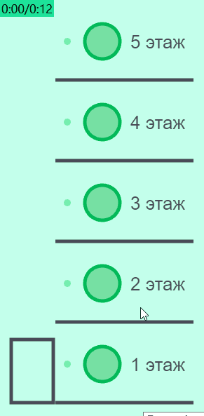

# Имитация работы лифта на TypeScript + PIXI.js

## Алгоритм скрипта:

1. &#11088; При нажатии на кнопку вызова лифта происходит: 
    - переключение индикатора (зелёная точка около кнопки меняет цвет), 
    - координата этажа добавляется в маршрут (массив чисел), 
    - массив сортируется (чтобы первым в маршруте был самый верхний этаж), 
    - вызывается функция передвижения лифта (с debounce 2 сек.).
2. &#11088; При запуске лифта происходит: 
    - кнопки блокируются (убирается интерактивность), 
    - вызываются в цикле с отложенным запуском функции передвижения лифта с анимацией движения (PIXI.Ticker).
3. &#11088; Состояние программы меняется на исходное. При этом:
    - кнопки становятся интерактивными, 
    - индикаторы и маршрут обнуляются.

Лифт готов к следующему запуску! &#128521;

